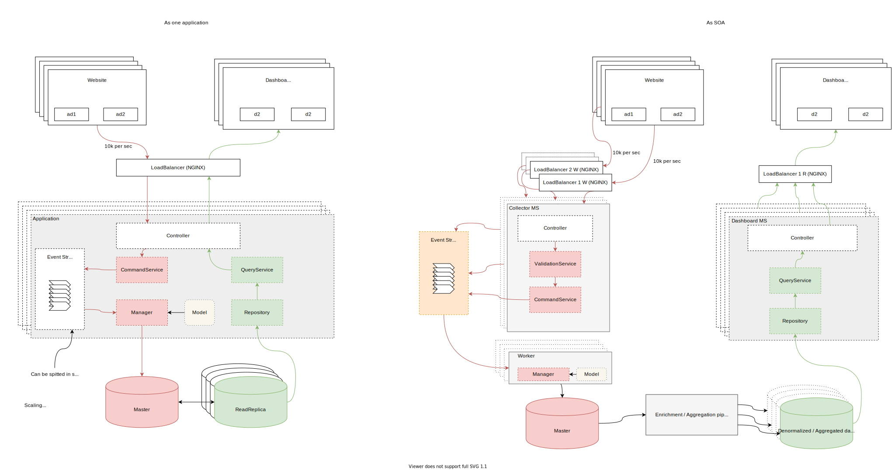

# Logektor ⚡️

System with high availability to store events/logs.

## Stack

- Client: `go` + `fasthttp`
- Event bus: `kafka`
- Workers: `python`
- DB: `postgres` <- To simplify my life

## Architecture

Single app 


SOA



## Setup

```sh
docker-compose up
```

For development

Client
```
go mod install

go run client/*.go
```

Worker
```
python3 -m venv venv

source venv/bin/activate

pip3 install -r requirements.txt

python3 -m worker
```